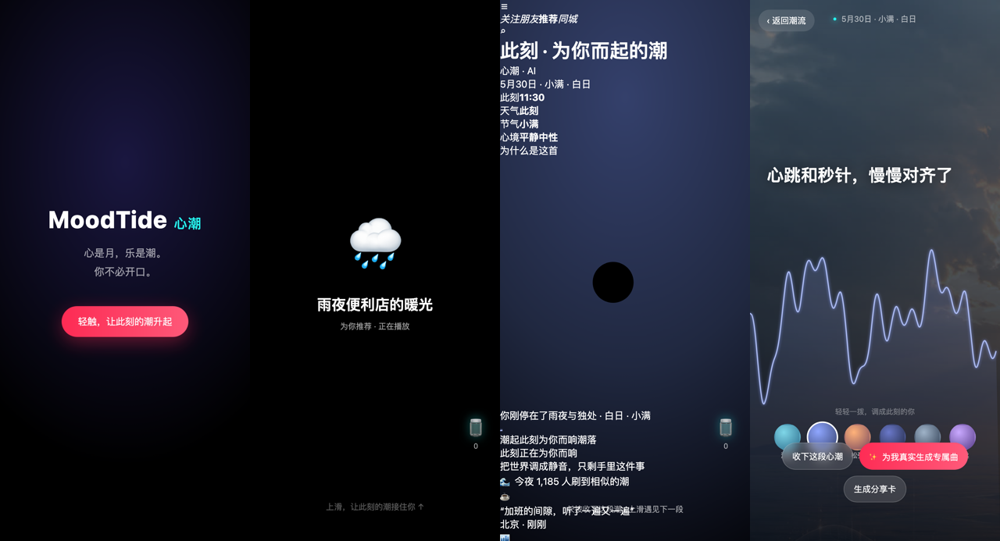

<div align="center">

# 🌊 MoodTide 心潮

**刷到就在响 · 按一下就带走 · 刷走即焚** —— 一张会呼吸的情绪音乐卡片

> 心是月，乐是潮。你不必开口，此刻的情绪自有引力，把一段只属于这一刻的旋律，从静默的海面里轻轻拉起。

[](./LICENSE)
[](https://vitejs.dev/)
[](https://www.typescriptlang.org/)
[](https://<your-username>.github.io/moodtide/)

抖音 AI 创变者计划黑客松 · **赛道三「刷到懂你的瞬间」** 参赛作品

[**🔗 在线体验**](https://<your-username>.github.io/moodtide/) · [English](#-english)



</div>

---

## 这是什么

市面上的 AI 音乐都要你**先开口、先等待、先点进去**。MoodTide 把「情绪 → 音乐」从一个 *功能*，压成一张**刷到就成立的信息流卡片**：

在你刷到它的 **0.5 秒**内，它已经读出屏幕外的此刻（时段 / 节气 / 可选天气），当场为这一刻、只为你，拉起一段**不会重复**的旋律。你什么都不用做，音乐已经在响；你唯一的一次互动，是**长按把这段心潮「收下」**，松手则任它退潮消失。

> 一句话定位：**第一个把 AI 音乐从「生成工具」变成「刷到即焚的信息流卡片」。**

## ✨ 亮点（都可以量化）

- 🌊 **视觉由声音长出**：Web Audio `AnalyserNode` 实时驱动 Canvas 声波海面，**60fps**，不是贴的循环动画——现场切歌，海面随之而变。
- ⚡ **零延迟刷到即响**：信息流卡片**绝不 loading**，靠本地合成器 / 预生成 mp3 池保证「按拇指那一刻就在响」。
- 🧠 **零输入读心**：环境上下文（时间 / 节气 / 天气）→ 情绪档位 → 配色 + 旋律情绪，**不问你心情，替你说出心情**。改系统时间或隔天再刷，文案 / 配色 / 旋律会**真的变**。
- 🛡 **四级降级链，永不挂**：`豆包音乐（主）→ Suno 代理（备）→ mp3 池 → 合成器`，任一在线引擎超时无缝下沉，保证必出声。
- 🎯 **极简交互**：长按收下进「潮汐瓶」，松手即退潮消失——**只有一个手势，没有第二个决策**。
- 📦 **极轻**：无前端框架，运行时仅 1 个依赖（GSAP），约 **8.6k 行** TypeScript / CSS，构建产物 **~56KB gzip**。

## 🧠 工作原理

```
环境信号                情境引擎              实时混音              声波可视化
时间/节气/天气   ──►   情绪档位 + 配色  ──►   合成器/音乐池   ──►   AnalyserNode → Canvas
(你不必开口)          (contextEngine)       (musicService)       (seaCanvas, 60fps)
```

把架构图里的 input 从「用户指令」改成「环境信号」，正是「你不必开口」的技术表达。

## 🏗 目录结构

```
src/
  context/     此刻情境引擎（时间/节气 → 情绪档位 + 配色）
  audio/       合成器引擎（零素材兜底）+ 音乐池抽象（可换真 mp3 / Suno）
  cards/       心潮卡片 + 声波海面 Canvas（AnalyserNode 实时驱动）
  feed/        抖音风格竖向信息流（scroll-snap 全屏）
  interaction/ 长按收下（唯一互动）
  store/       潮汐瓶本地持久化 +「记得你」
  detail/      第二层详情（情绪轮微调、生成专属曲、分享卡）
  llm/         豆包 ARK 接入（可选，读心文案 / 作曲 prompt，走 BFF）
  share/       分享卡导出（传播引擎）
server/        BFF（可选，持 key 代理豆包 / Suno）—— 见下方「真实音乐生成」
public/audio/  预生成情绪音乐池（放 mp3 即升级真实音乐）
docs/          完整方案 PLAN.md / 设计 DESIGN.md / 路演稿
```

## 🚀 本地运行

```bash
npm install
npm run dev              # 本机预览：http://localhost:5173
npm run dev -- --host    # 手机真机：同局域网用手机访问终端给出的地址
```

进入后点「轻触，让此刻的潮升起」解锁音频（浏览器自动播放策略要求一次手势），随后即进入抖音风格全屏竖向信息流，**首张卡片 = 你的真实当下**。

> 💡 **想看「持续变化是真的」**：把系统时间改到深夜 / 隔天再刷，卡片的文案、配色、旋律情绪会真的变化——证明「此刻情境」是实时算出来的。

构建与一键公网预览：

```bash
npm run build            # 类型检查 + 生产构建到 dist/
npm run go               # 一键启动 + Cloudflare 临时隧道 + 终端二维码（手机扫码即玩）
```

## 📡 真实音乐生成（可选）

**默认开箱即用**：第一层信息流完全跑在**本地合成器**上，无需任何 API key，零配置即可完整体验。

如果想接入「真实当场生成」的音乐 / 大模型读心文案，`server/index.ts` 预留了 BFF（持 key 代理）的接口约定。⚠️ **当前为占位 stub，尚未实现**，欢迎 PR：

```bash
# .env（勿提交，已在 .gitignore）
ARK_API_KEY=...            # 火山方舟豆包（读心文案 / 作曲 prompt）
ARK_MODEL=doubao-pro-...
SUNO_API_KEY=...           # sunoapi.org（可选，第三方 Suno 代理）
```

key 全程只在后端，不进前端。在线引擎失败会无缝降级到合成器，所以**没有 key 也永远有声音**。

## 🏆 比赛背景

为**抖音 AI 创变者计划黑客松联赛 · 赛道三「AI 体验：刷到懂你的瞬间」**而作。完整方案、评分策略与设计稿见 [`docs/PLAN.md`](docs/PLAN.md) / [`docs/DESIGN.md`](docs/DESIGN.md)。

## 📄 License

[MIT](./LICENSE) © 2026 MoodTide Authors

---

## 🌐 English

**MoodTide** turns "emotion → music" from a *feature* into a **living feed card that's already alive the instant you scroll to it.**

Every other AI-music product makes you *speak first, wait, and tap in*. MoodTide reads your off-screen *now* (time of day / solar term / optional weather) within **0.5s** and pulls up a **never-repeating** melody made for this exact moment — you do nothing, the music is already playing. Your single interaction is to **press-and-hold to keep** the tide; let go and it recedes into silence forever.

**Highlights (all measurable):**
- 🌊 **Visuals grown from sound** — a Canvas "sound-wave sea" driven in real time by the Web Audio `AnalyserNode` at **60fps**. Not a looping animation: swap the track and the sea changes with it.
- ⚡ **Zero-latency** — the feed card *never* shows a loading state; a local synth / pre-generated mp3 pool guarantees sound the moment your thumb lands.
- 🧠 **Zero-input mind-reading** — environmental context → mood tier → palette + melody mood. Change your system clock and the copy / colors / melody actually change.
- 🛡 **4-tier fallback, never fails** — `Doubao Music → Suno proxy → mp3 pool → synthesizer`. Any online engine timing out silently sinks to the next tier.
- 📦 **Tiny** — no frontend framework, 1 runtime dependency (GSAP), ~8.6k lines of TS/CSS, ~56KB gzip build.

**Run it:**
```bash
npm install && npm run dev      # http://localhost:5173
```
Tap "let this moment's tide rise" to unlock audio (browsers require one gesture), then you're in a TikTok-style full-screen vertical feed — **the first card is your real present moment.**

Real music generation via Doubao/Suno is wired through an optional backend-for-frontend (`server/index.ts`, currently a stub — PRs welcome). With no API keys, the local synthesizer means **there is always sound**.

Built for the **Douyin (TikTok China) AI Hackathon — Track 3**. License: [MIT](./LICENSE).
